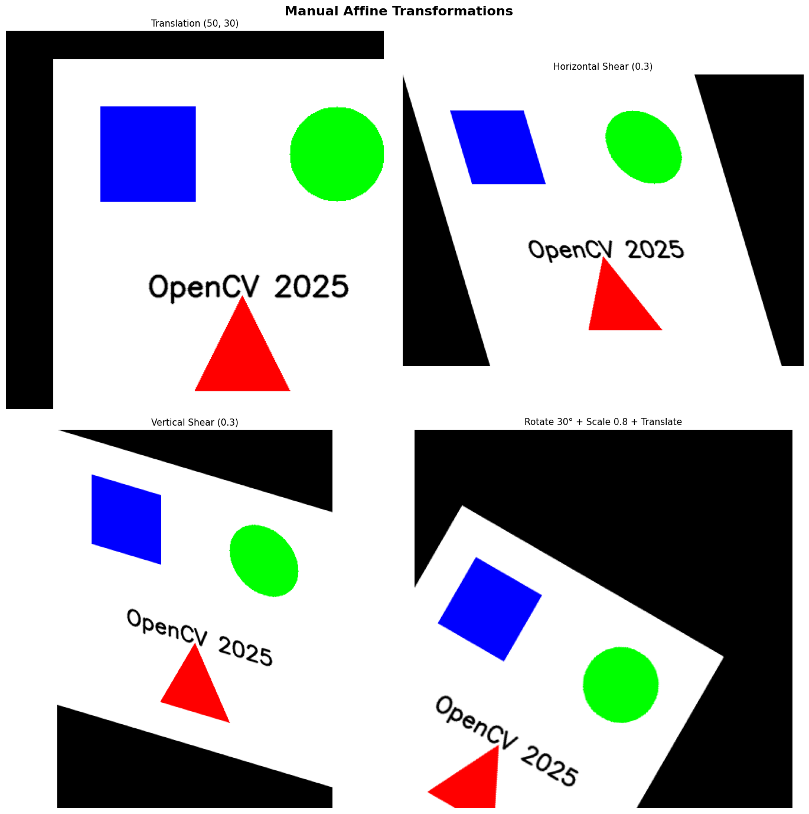
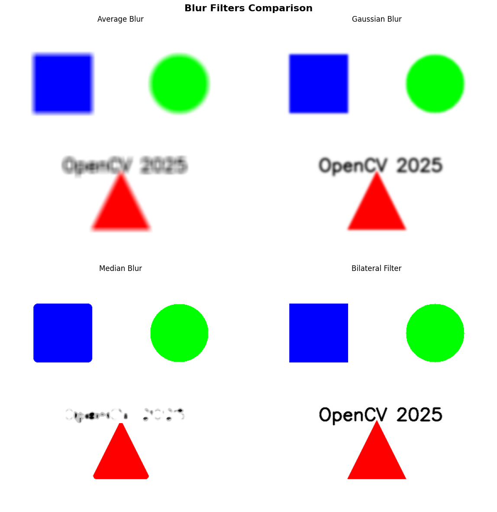

# 🧾 Daily Report - {{2025.11.24}}

**Project / Course:** 
**Author:** MARKCH

---

## 1. 오늘의 목표
- AI응용 : OpenCV 기하학적 변환 (9h)
- 코테
- 일일 로그 작성 

## 2. 수행 내용
- AI응용 : 
    - 샘플 이미지에 필터와 기하학적 변환을 적용하여, 노이즈를 제거하고 특징을 추출
    - 이상치가 특별히 크게 튀는 이미지에 대해서는 평균필터나, 가우시안 필터보다 중간값 필터가 더 효과적임을 확인
    - 아핀 변환과 perspective 변환을 사용하여 이미지의 기하학적 특성을 추출 및 이미지 증강으로 모델의 성능 향상 가능성 확인 
    - 8 DOF의 개념을 통해 perspective 변환과 사물의 움직임을 np 배열상 표현하고, 이해
    - 실습1.OpenCV 기하학적 변환: 이미지에 필터를 적용하여 이미지의 변화 확인
    - 실습2.OpenCV 기하학적 변환 응용: 이미지에 필터, 변환을 가하여 원본 이미지의 기하학적 특징 추출
- 코테
- 일일 로그 작성 :
    - 노션을 활용하여 수업 내용을 정리하고, 노션의 데이터베이스 활용법을 습득

## 3. 결과 / 진척도
- AI응용 :
    - **구현:** 주어진 이미지를 지정된 각도로 회전시키거나, 네 개의 꼭짓점을 기준으로 새로운 평면(뷰)으로 투영하는 원근 변환을 성공적으로 구현
    - **비교:** 특히, 이미지 크기를 키울 때 **$INTER\_NEAREST$**의 계단 현상과 **$INTER\_LANCZOS4$**의 부드러움 등, 보간법에 따른 이미지 품질 변화를 육안으로 확인하고 비교
    - 노이즈 유형별 필터링 결과 : 샘플에 의도적으로 노이즈를 추가한 후, median filter를 적용하여 배경정보는 유지하면서 노이즈 픽셀을 90% 이상 제거 성공
    - 엣지 정보 시각화 : 이미지의 구조를 나타내는 엣지를 Canny 알고리즘으로 추출하고, 이를 엣지기반 객체인식 모델의 입력 데이터로 활용가능함을 확인 

이미지1

이미지2

이미지3

## 4. 트러블 슈팅 및 문제해결
- 개발 과정에서의 에러 해결 로그
    - cv2.warpAffine의 변환 함수의 출력 이미지 크기를 너무 작게((400,400)에서 (10,10))으로 입력하여 출력 불가
    - 오류 메시지가 발생하지 않는 오류상황
    - 출력 이미지를 img.shape의 인자로 입력하여 문제 해결
    - 코드   
matrix_45 = cv2.getRotationMatrix2D(
    center,     # 중심점(x, y)
    45,         # 회전각도(양수 = 반시계 방향) 양반음시(양: 반시계, 음: 시계)
    1.0         # 스케일(1.0 원본크기 유지)
)

rotated_45 = cv2.warpAffine(
    sample_img,
    matrix_45,
    (width, height)
)

- 코테 : 코테를 할 시간을 확보하기 위해, 20시 30분에는 코테를 켜기.

## 5. 분석 / 인사이트
- AI응용 :
    - **기초 이해:** 모든 고급 컴퓨터 비전 및 이미지 처리 기술의 근간이 되는 **변환 행렬**과 **보간법**의 중요성을 이해
    - **응용 가능성:** 이 기하학적 변환 기술은 실제 딥러닝 프로젝트에서 **데이터 증강(Data Augmentation)** 기법으로 활용되어, 모델의 **일반화 성능**을 높이는 데 핵심적인 역할을 할 수 있음을 깨달음
    - 필터 선택의 중요성 : 모든 필터가 노이즈를 제거하지만, **Average Blur**는 엣지를 뭉개고, **Bilateral Filter**는 엣지를 보존하는 등 필터의 선택이 **후속 분석 모델** (예: 객체 인식, 세그멘테이션)의 성능에 직접적인 영향을 미친다는 것을 정량적으로 이해
    - **전처리 최적화:** **엣지 검출**은 복잡한 환경에서 객체의 위치를 빠르게 찾을 수 있는 강력한 **특징점 추출** 기법이며, **Canny**의 매개변수 (`low_threshold`, `high_threshold`) 조정을 통해 **정보량**과 **정확도** 사이의 균형을 맞추는 **데이터 전처리 최적화** 역량을 확보
    - **응용 방향 제시:** 이 기술들은 **자율 주행 시스템**에서 도로 표지판의 엣지를 빠르게 검출하거나, **의료 영상**에서 병변의 경계를 명확히 하는 등 다양한 분야의 핵심 전처리 기술로 활용 가능

## 6. 내일 계획
- AI응용 수강 : OpenCV 기하학적 변환 (9h)
- 코테
- 일일 로그 작성 
